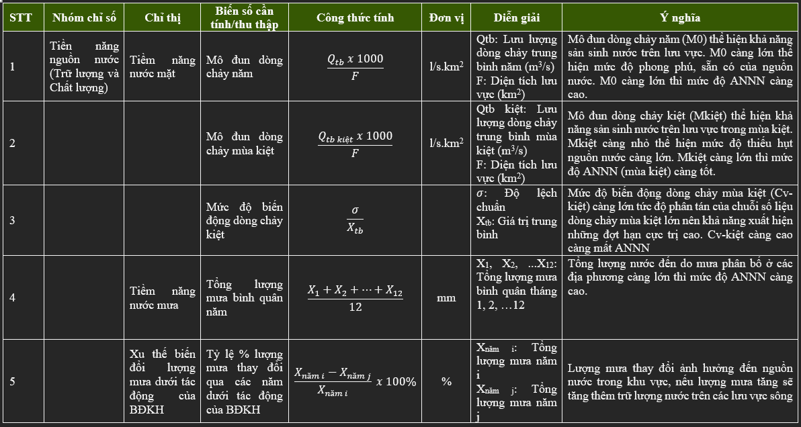
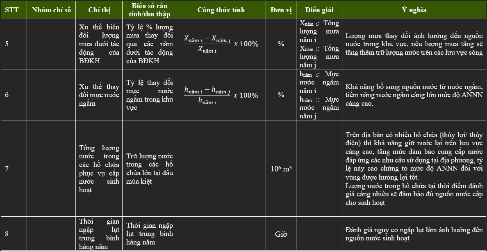
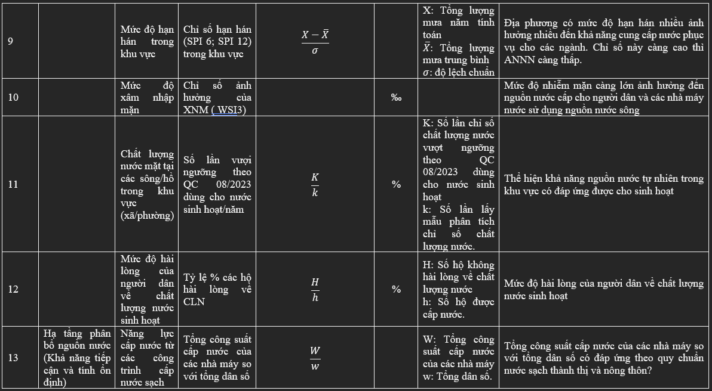
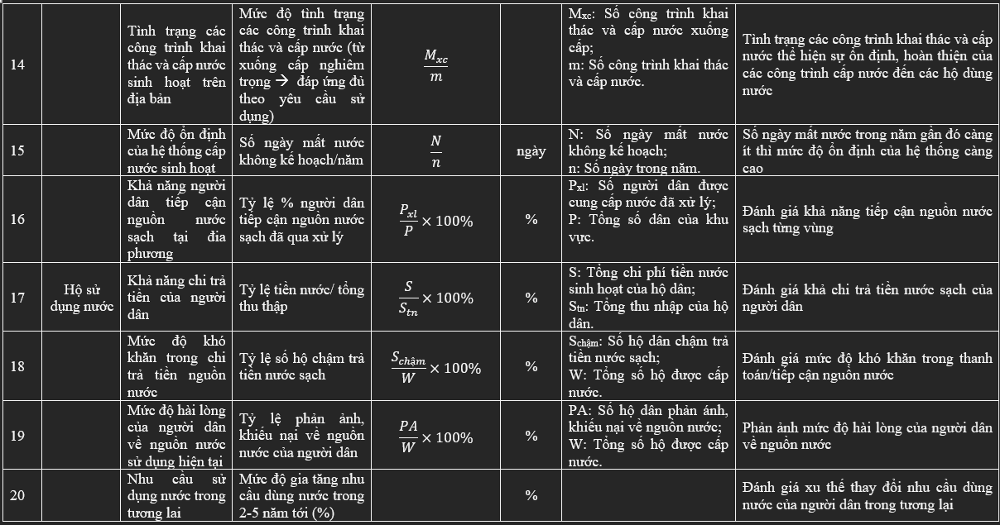
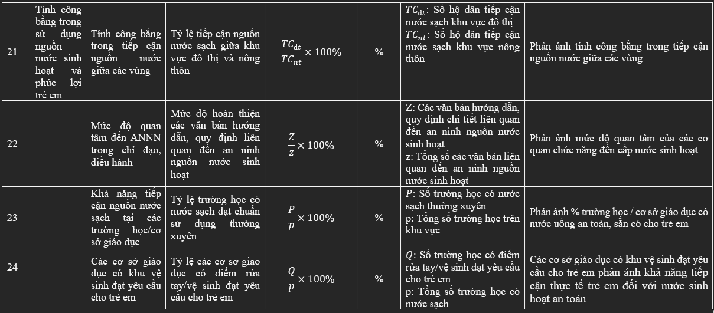

### làm 1 web lập trình gồm những phần sau:
* Giao diện 1. Lựa chọn các chỉ số ANNN SH muốn tính (24 chỉ số đó lần lượt là: ) 
	- => chỉ số muốn tính toán như sau
    
    
    
    
    
* Trong đó: 
    - Cột 1 là số thứ tự các chỉ số. 
    - Cột 2 là nhóm chỉ số 
    - Cột 3 là Chỉ thị (Tên của chỉ số ANNN SH)
    - Cột 4 Tên biến số cần tính/ cần nhập ( cần tính sẽ có công thức ở cột 5, cần nhập sẽ không có công thức)
    - Cột 5 công thức tính cho biến số ở cột 4 
    - Cột 6 là đơn vị (nếu có) của biến số ở cột 4
    - Cột 7 là diễn giải ý nghĩa của từng kí hiệu trong công thức
    - Cột 8 là ý nghĩa của biến số, chỉ thị
    - => next sang giao dien 2
* Giao diện 2. Nhập vào giá trị: 
    - Dựa vào các chỉ thị đã chọn: hiển thị ra màn hình biến số cần tính/ thu thập và giao diện để nhập giá trị
	- Có 2 lựa chọn là nhập giá trị từ file csv hoặc nhập trực tiếp (không nhất thiết phải nhập cả 2). (Các giá trị nhập từ file csv là giá trị đã có sẵn. Giá trị nhập trực tiếp là giá trị hiện tại hoặc dự báo tương lai.) Nên khi nhập cả hai, thì tính ra 2 kết quả của biến số là 'Giá trị ANNN SH quá khứ" và "Giá trị ANNN SH mới"
	- Ở giao diện nhập vào, có thể xem được diễn giải, chú thích, ý nghĩa của từng công thức (khi bấm vào kí hiệu của biến số, công thức)
    - Khi đã nhập đầy đủ giá trị, nhấn nút "Tính", chuyển sang giao diện 3
* Giao diện 3. Tính toán:
	- Dựa vào các công thức và giá trị đã nhập, tính toán theo công thức ở cột 5. Nếu những biến số không cần tính (không có công thức) thì hiển thị luôn giá trị
	- Hiển thị kết quả của từng biến số đã tính/ thu thập ( dạng bảng ) 
	- Nhấn "Lưu" để lưu lại kết quả tính toán ra file csv và chuyển sang giao diện 4
* Giao diện 4. So sánh kết quả
	- So sánh sự khác nhau giữa các kết quả của các lần tính toán (nếu có) bằng cách nhập vào các file csv kết quả tính toán đã được lưu trước đó từ file csv.